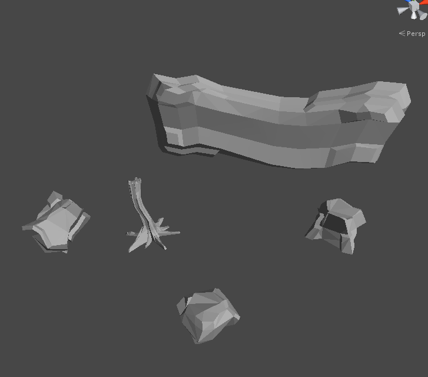
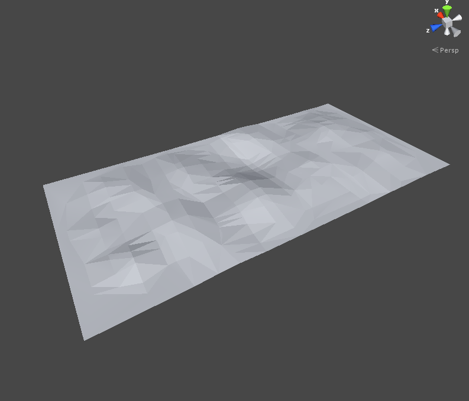
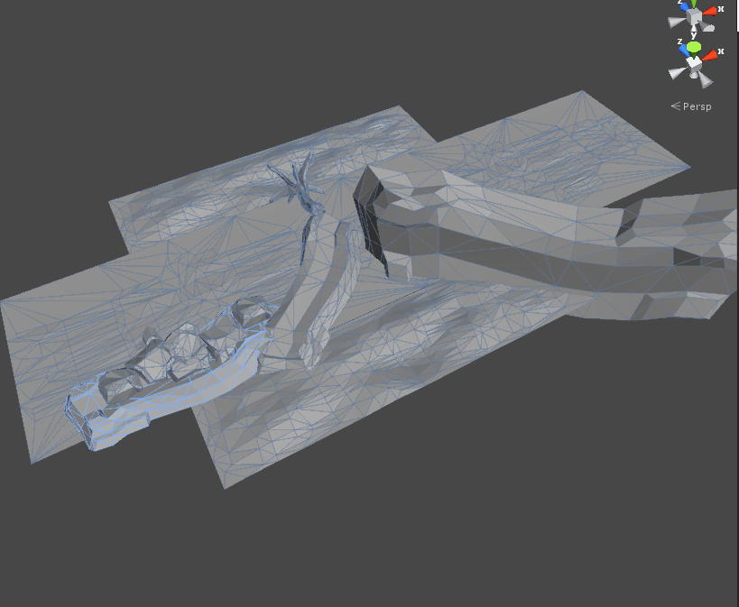
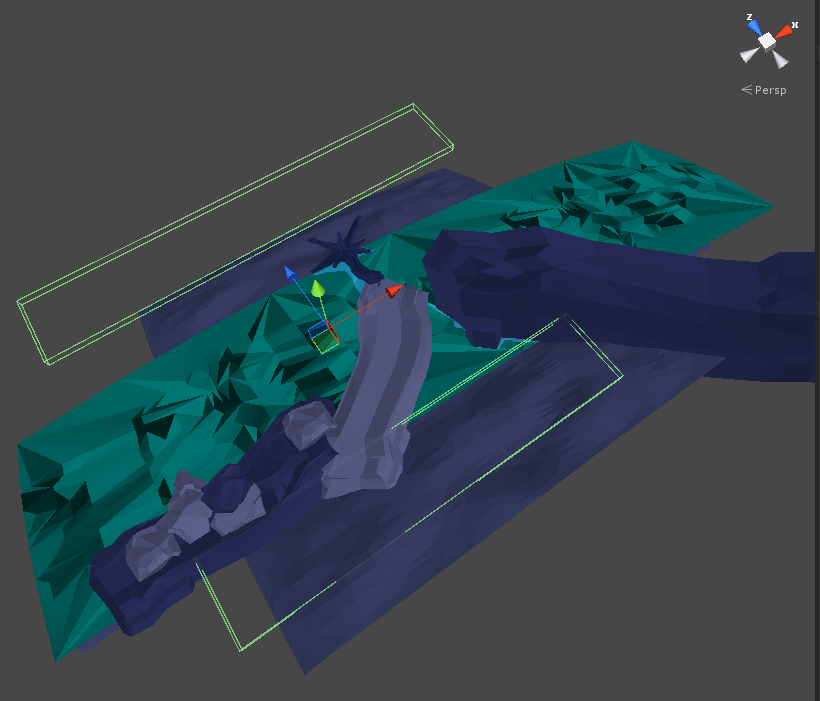
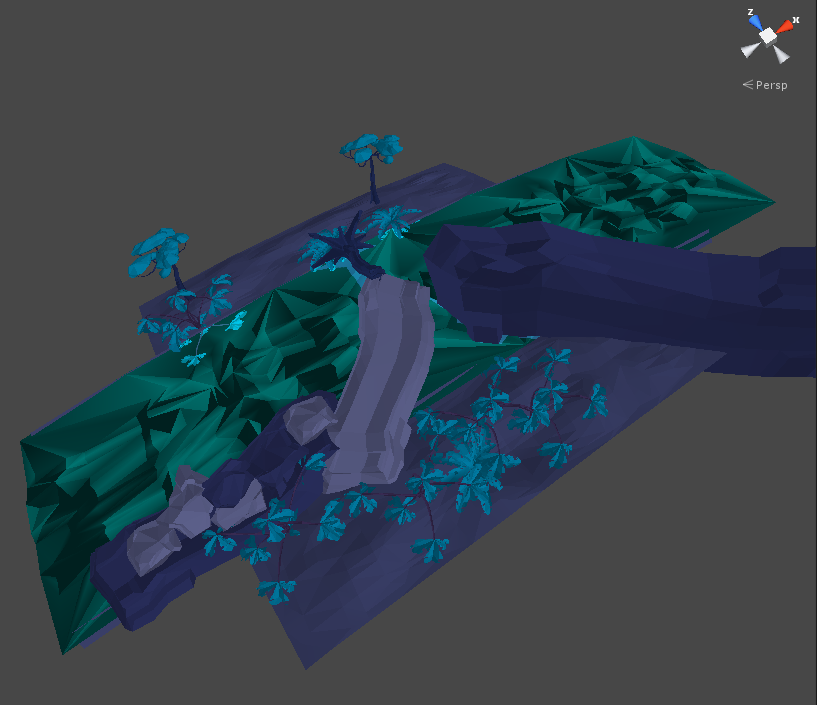

This post is about the workflow we used at Global Game Jam 15 to create <a href="http://angrysquidgames.itch.io/fox-ears">Fox Ears</a>, and specifically how we were able to create its low-poly, faceted aesthetic, and how our level generation worked.

### Background
To achieve our faceted look, the most important step was having properly created assets. By default, models in Unity have smooth normals, which gives them a nice gradated look. This is ideal if you're going for a more realistic style, specifically because it prevents the faceted look we were going for. For our look, we needed each vertex of a face to have the same normal, so we would get those nice hard edges between faces.

### Asset Creation
For the jam, this process mostly fell on the artist. She created the assets as she normally would (quads, keeping the poly count down but making the model smooth), then triangulated and reduced the model until it had was sufficiently faceted. She then ensured normal smoothing was off, and exported the model so it could be brought into Unity.

<figure>
	
	<figcaption>Shot of some of the assets used in the jam version of Fox Ears, freshly imported into Unity.</figcaption>
</figure>

### Shaders
As you can see, even the default Unity shaders give a nice faceted look at this stage. However, the shadows are extremely harsh, since they're expecting a slow build up to the full colour, rather than a sudden change. So, we elected to create a shader that allowed us control over the shadow colour of materials, which created a much softer, more cartoon-y effect.

I won't go into too much detail on the technical side of the shader here (see my Shaders post for that), but the basic gist of it is that you add the desired shadow colour to the final colour output of the lighting calculation. TODO actually understand and describe this shader

### Tile Creation
Next in the process is actually creating the tiles that populate Fox Ears' world. As you progress through the world, a random tile is picked from the pool of available tiles and attached to the current end of the level. We designed it so this generation would be modular; we would only have to drop a tile into the specified resources folder and it would be included. This meant that regardless of the number of tiles we were able to create, they would all be included, and the game would be playable. 

<figure>
	
	<figcaption>The basic ground model every tile was built on.</figcaption>
</figure>

Each tile started as a single plane. Rather than using Unity's built-in plane (which has smoothed normals), we used a plane generated by our artist, which had some noise baked in. (We also had a second plane, which was used as a base for the water tiles). The bent horizon effect is achieved through a shader; every tile is a flat plane. This made lining objects up difficult at times (as the effect also worked in scene view), and since at the time the amount of world bending was being specified per-material, it wasn't easy to temporarily disable it (this has since been fixed, as explained in my Shaders post).

<figure>
	
	<figcaption>Static obstacles placed on the tile.</figcaption>
</figure>

We populated these planes with various objects to try to create interesting play spaces for the player. Once we were satisfied with the basic tile layout, we could add areas that would spawn decorative props randomly, and adjust their object density. These areas were just GameObjects with a BoxCollider that defined the area to spawn things in, and a script that we gave the directory to load resources from to fill that area. And after that, the tile was ready to be played!

<figure>
	
	<figcaption>The tile after the proper materials have been applied. The two boxes are prop spawning areas (they also show where the plane really is, and how drastic the world bending effect can be).</figcaption>
</figure>

<figure>
	
	<figcaption>And the final, in-game product. Each prop area is generated at runtime, so it's different each time.</figcaption>
</figure>

And that wraps up this fairly high-level overview of how we achieved the look of Fox Ears. If you're interested in more specific information, check out some of my other posts about Fox Ears, or feel free to contact me on <a href="https://www.twitter.com/craigrthomas">Twitter</a>!