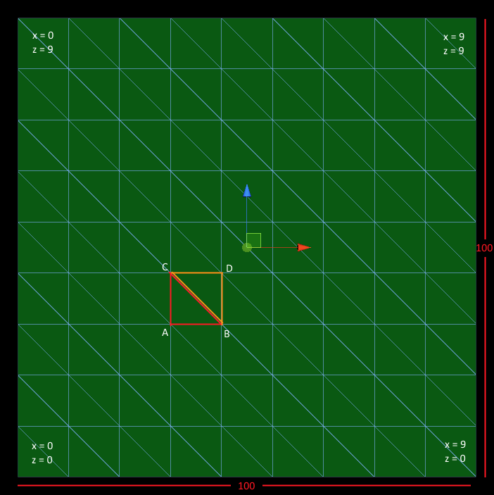

Fox Ears was made as part of the 2015 Global Game Jam. You can see a video of the game in action <a href="https://www.youtube.com/watch?v=97rNvLYpQCQ">here</a>, and you can download it on our <a href="http://angrysquidgames.itch.io/fox-ears">itch.io page</a>.

Moving forward with Fox Ears, we knew we wanted more robust terrain than the static models made for the game jam. The three most obvious options were to continue to use hand made models, to use Unity's built in terrain tools/modify Unity's plane, or to generate our own meshes and use those.

While the hand made models worked really well for the jam, they left a lot to be desired. It really restricted tile design and sometimes led to seams between segments, and meant that we didn't have a whole lot of control over the layout of terrain. A generated option seemed much more desirable.

Using Unity's existing terrain or their in-engine meshes would obviously be the next best thing, but this proved not to be an ideal option either. Unity's terrain and meshes both auto-generate smoothed normals, which doesn't really work with the low-poly look we were going for. So, our final option was to generate our own meshes.

### Mesh Generation In Unity
Unity actually makes mesh generation very easy. First let's take a look at the basic skeleton for our base class, LowPolyTerrain:



using UnityEngine;
using System.Collections;

[RequireComponent(typeof(MeshFilter))]
[RequireComponent(typeof(MeshRenderer))]
[System.Serializable]
public abstract class LowPolyTerrain : MonoBehaviour {

	public float widthInUnits;
	public float lengthInUnits;
	public float height;
	public int widthInVerts;
	public int lengthInVerts;
	public Vector3 minOffset;
	public Vector3 maxOffset;

	public uint uniqueID;
	bool uniqueIDSet = false;

	[HideInInspector]
	public Mesh mesh = null;

	public virtual void GenerateMesh() {}

	protected void GenerateUniqueID() {}

	protected virtual Vector3[] GenerateVertices() {}

	protected virtual Vector3[] GenerateNormals() {}

	protected virtual Vector2[] GenerateUVs() {}

	protected virtual int[] GenerateTriangles() {}

	protected virtual void GenerateOffsets(bool resetVertices = true) {}
}



**widthInUnits & lengthInUnits** are the dimensions in world units of the terrain (along the x and z axis respectively).  
**height** is the world y value the terrain gets generated at. 
**widthInVerts & lengthInVerts** are the dimensions in vertices of the terrain. This lets us control the vertex density of the mesh and have more/less detail available.  
**minOffset & maxOffset** define the bounds of the vertex offset function. We offset the vertices a little so the terrain deviates from a straight plane and has a more traditional low-poly look, as well as just being more interesting. 
**uniqueID** is used to identify the Mesh asset we create. 
**mesh** is the actual Mesh asset. 
{: .notice}

Now let's look at the basic **GenerateMesh** function:


public virtual void GenerateMesh() {
	GenerateUniqueID();

	mesh = new Mesh();
	GetComponent<MeshFilter>().mesh = mesh;

	mesh.vertices = GenerateVertices();
	mesh.uv = GenerateUVs();
	mesh.triangles = GenerateTriangles();
	GenerateOffsets(false);
	mesh.normals = GenerateNormals();
}


We create a new Mesh object and set it as the active Mesh for the object's MeshFilter, then fill it with the data we need. **GenerateVertices, GenerateUVs, GenerateTriangles, GenerateOffsets, & GenerateNormals** all generate the data for the Mesh, we'll cover them in more detail below. There are some dependencies in the order this data is calculated: the UVs, offsets, and normals all require that the vertices have already been calculated; the offsets also require that the UVs have already been calculated; and the normals should be calculated after the offsets so the offsets are taken into account for lighting. The triangles could be calculated at any point.

Before we dive into the code, here's an image of a plane generated with these terrain tools, labelled with some of the variables used to help illustrate what they represent.

<figure>
	
</figure>

### Generating The Vertices


protected virtual Vector3[] GenerateVertices() {
	Vector3[] vertices = new Vector3[(widthInVerts-1) * (lengthInVerts-1) * 3 * 2];

	float widthPerVertex = widthInUnits / (float)(widthInVerts - 1);
	float lengthPerVertex = lengthInUnits / (float)(lengthInVerts - 1);
	float halfWidth = widthInUnits / 2.0f;
	float halfLength = lengthInUnits / 2.0f;

	int faceIndex = 0;
	for (int x = 0; x < widthInVerts - 1; x++) {
		for (int z = 0; z < lengthInVerts - 1; z++) {
			vertices[faceIndex * 3]		  = new Vector3((x * widthPerVertex) - halfWidth, height, (z * lengthPerVertex) - halfLength);
			vertices[faceIndex * 3 + 1]   = new Vector3((x * widthPerVertex) - halfWidth, height, ((z + 1) * lengthPerVertex) - halfLength);
			vertices[faceIndex++ * 3 + 2] = new Vector3(((x + 1) * widthPerVertex) - halfWidth, height, (z * lengthPerVertex) - halfLength);

			vertices[faceIndex * 3]		  = vertices[(faceIndex - 1) * 3 + 2];
			vertices[faceIndex * 3 + 1]	  = vertices[(faceIndex - 1) * 3 + 1];
			vertices[faceIndex++ * 3 + 2] = new Vector3(((x + 1) * widthPerVertex) - halfWidth, height, ((z + 1) * lengthPerVertex) - halfLength);
		}
	}

	return vertices;
}

The first thing we need to do is figure out how many vertices we'll have. Because we want hard edges, and Unity uses per-vertex normals, we can't have faces sharing vertices, so we have to duplicate the vertex data for each face. The number of quads in the plane can be found by multiplying **widthInVerts-1** by **lengthInVerts-1**. We then multiply by **2** to get the number of triangles, and multiply that by **3** to get the number of vertices we'll have. We use this number to allocate the array of vertices that will get passed to our Mesh.

Next we calculate some values:

**widthPerVertex & lengthPerVertex** is the distance along the x-axis and z-axis (respectively) between each vertex. 
**halfWidth & halfLength** are used to offset the vertices by half the plane's size so the Mesh is built centered on the GameObject's origin.
{: .notice}

Finally, we fill the array with the data for each vertex. We do this per quad, setting 6 vertex values at once. Since we use a 2D iteration, **faceIndex** is used as the index into the 1D vertex array.

In the image above, you can see our basic contruction plan on the highlighted quad around the middle. We build each quad by constructing two triangles; first the red (using verts A-C-B), then the orange (using verts B-C-D) (these orders are used because we're using clockwise winding; they would have to be adjusted for a counter-clockwise rendering setup).  We store the vertices for each tri consecutively in the vertex array. 

For the first triangle of each quad, we calculate all of the values for each vertex. Our iterators (**x & z**) represent the values of the vertex at point **A** for each quad, which means point **B = A + (1,0)**, **C = A + (0,1)**, and **D = A + (1,1)**. 

For the second triangle, we can re-use the values we calculated for points **B** and **C**, then we have to calculate point **D**. Once that's done for each quad, we have our array of vertices completed!

### Generating The UVs
UV generation is very straightforward; the UV for each vertex is simply the percentage of the way it is along each axis. The only sort of tricky part is we have to account for the offset we used to center the mesh around the origin:


protected virtual Vector2[] GenerateUVs() {
	Vector2[] uvs = new Vector2[mesh.vertices.Length];
	float halfWidth = widthInUnits / 2.0f;
	float halfLength = lengthInUnits / 2.0f;
	for (int i = 0; i < uvs.Length; i++) {
		uvs[i] = new Vector2((mesh.vertices[i].x + halfWidth) / widthInUnits, (mesh.vertices[i].z + halfLength) / lengthInUnits);
	}
	return uvs;
}


We simply iterate through each vertex, add half the width and length of the plane to its **x** and **z** values, and divide those by the total width and length to figure out its UV values.

### Generating The Triangles
Once again, this is a very straightforward step. The triangle array is a set of integers that serve as indices into the vertex array. Because of the way we set up our arrays of information, our triangle array is a simple linearly increasing function:


protected virtual int[] GenerateTriangles() {
	int[] triangles = new int[mesh.vertices.Length];
	for (int i = 0; i < triangles.Length; i++) {
		triangles[i] = i;
	}
	return triangles;
}


### Generating The Offsets (Creating Noise)
So far, the plane we've generated is completely flat, and kind of boring. There is visually no difference between our plane and the default Unity plane, in fact. Adding a little noise will make the hard edges show, and really accentuate the low poly look. Let's look at the code:


protected virtual void GenerateOffsets(bool resetVertices = true) {
	Vector3[,] offsets = new Vector3[widthInVerts, lengthInVerts];
	for (int x = 0; x < widthInVerts; x++) {
		for (int z = 0; z < lengthInVerts; z++) {
			if (z == 0 || z == (lengthInVerts - 1)){
				offsets[x, z] = Vector3.zero;
			} else {
				offsets[x, z] = new Vector3(Random.Range(minOffset.x, maxOffset.x),
												Random.Range(minOffset.y, maxOffset.y),
												Random.Range(minOffset.z, maxOffset.z));
			}
		}
	}

	Vector3[] newVertices = (resetVertices) ? GenerateVertices() : mesh.vertices;
	for (int i = 0; i < newVertices.Length; i++) {
		int xIndex = Mathf.RoundToInt(mesh.uv[i].x * ((float)widthInVerts - 1.0f));
		int yIndex = Mathf.RoundToInt(mesh.uv[i].y * ((float)lengthInVerts - 1.0f));
		newVertices[i] += offsets[xIndex, yIndex];
	}
	mesh.vertices = newVertices;
}


The first thing we do here is generate a random offset per vertex. We do this so every face that shares the same vertex gets the same offset for that vertex, otherwise we'd have seams all over our geometry. This basic plane generates completely random offsets (within the defined range), but this could obviously be reworked to create more interesting patterns. 

We also force the offset to be zero if the **z** value is **0** or **lengthInVerts-1**, so our planes will have flat edges and will fit together seamlessly. This could be adapted to work along the x-axis, or at heights other than 0.

Once we've generated these offsets, we iterate through each vertex and apply the offset. The **resetVertices** flag is there so we can hook this function up to our editor script, and regenerate the offsets without regenerating the whole mesh, or so we can apply multiple iterations of the offset function. We use each vertex's UV values to figure out the indices to the offset array, since the UV values will be the same no matter which face the vertex belongs to.

### Generating The Normals
Finally, we have to generate the normals for the mesh. We do this last so we take into account the newly offset positions of the vertices during normal calculation. The code for this can be seen below:


protected virtual Vector3[] GenerateNormals() {
	Vector3[] normals = new Vector3[mesh.vertices.Length];
	Vector3 tri1, tri2, normal;

	int triCount = (widthInVerts - 1) * (lengthInVerts - 1) * 2;
	for (int i = 0; i < triCount; i++ ) {
		tri1 = Vector3.Normalize(mesh.vertices[i * 3 + 1] - mesh.vertices[i * 3]);
		tri2 = Vector3.Normalize(mesh.vertices[i * 3 + 2] - mesh.vertices[i * 3]);
		normal = Vector3.Normalize(Vector3.Cross(tri1, tri2));
		for (int v = 0; v < 3; v++) {
			normals[i * 3 + v] = normal;
		}
	}

	return normals;
}


We calculate the normals per triangle to preserve our hard edges, and store them per vertex. To calculate the normal for each triangle, we compute the cross product C-A x B-A and for the other tri, C-B x D-B. Following the right-hand-rule, it should be that our vectors are the other way around, however for some reason this gives incorrect results in Unity.

Once we have the normal for the triangle, we store it for each vertex, and continue on to the next one.

### Putting It All Together
Now that our base class is done, let's take a look at a very simple derived class that is looking to create a basic plane:


public class LowPolyPlane : LowPolyTerrain {
	
	public override void GenerateMesh() {
		base.GenerateMesh();

		mesh.name = "Low Poly Plane Mesh";
	}

	void Start() {
		
	}

	void Update() {

	}
}


...and that's it! If we wanted to generate the mesh each time the game is run, we would just call **GenerateMesh** from **Start** or **OnEnable** and be done. However, we wanted more control over the shape of our tiles, and wanted to store interesting terrains we generated. To do this, we use the Editor script below:


[CustomEditor(typeof(LowPolyPlane))]
public class LowPolyPlaneEditor : Editor {

	Material mat, newMat;

	public override void OnInspectorGUI() {
		LowPolyPlane plane = target as LowPolyPlane;
		if (mat == null) {
			mat = plane.GetComponent<Renderer>().sharedMaterial;
			newMat = mat;
		}

		GUILayout.Label("Plane Settings", EditorStyles.boldLabel);

		plane.widthInUnits = EditorGUILayout.FloatField("Width (units):", plane.widthInUnits);
		plane.lengthInUnits = EditorGUILayout.FloatField("Length (units):", plane.lengthInUnits);
		plane.height = EditorGUILayout.FloatField("Height (units):", plane.height);
		plane.widthInVerts = EditorGUILayout.IntField("Width (verts):", plane.widthInVerts);
		plane.lengthInVerts = EditorGUILayout.IntField("Length (verts):", plane.lengthInVerts);
		newMat = EditorGUILayout.ObjectField("Material:", newMat, typeof(Material), false) as Material;
		if (newMat != mat) {
			plane.GetComponent<Renderer>().material = newMat;
			mat = newMat;
		}
		plane.minOffset = EditorGUILayout.Vector3Field("Minimum Random Offset:", plane.minOffset);
		plane.maxOffset = EditorGUILayout.Vector3Field("Maximum Random Offset:", plane.maxOffset);

		if (plane.widthInUnits <= 0) plane.widthInUnits = 1;
		if (plane.lengthInUnits <= 0) plane.lengthInUnits = 1;
		if (plane.widthInVerts <= 0) plane.widthInVerts = 1;
		if (plane.lengthInVerts <= 0) plane.lengthInVerts = 1;

		if (GUILayout.Button("Create Plane")) {
			plane.GenerateMesh();

			if (plane.gameObject.GetComponent<MeshCollider>() != null) {
				Object.DestroyImmediate(plane.gameObject.GetComponent<MeshCollider>());
			}
			plane.gameObject.AddComponent<MeshCollider>();

			AssetDatabase.CreateAsset(plane.mesh, "Assets/_FoxEars/Models/Tile Components/Generated Terrain/" + plane.uniqueID + ".mesh");
			AssetDatabase.SaveAssets();
		}
	}

	public void OnDisable() {
		mat = newMat = null;
	}

}


First, we get the target object and cast it as our LowPolyPlane, and we initialize our temporary materials to whatever the current object has set. Next, we collect the various information for the settings for the plane, and apply a little data validation to it so the results are sane/don't cause errors. Finally, we add a button that generates the mesh, and updates the Asset Database so Unity will recognize it. Note that the directory specified in the call to **AssetDatabase.CreateAsset** needs to exist beforehand, or it will throw an error. Also, if we fail to set **mat** and **newMat** to null in **OnDisable**, our object will leak materials into the scene.

Now when we select a LowPolyPlane in our scene, its inspector will show a "Create Plane" button which we can click to generate a new mesh with the most recent settings we've set.

In an upcoming blog post, we'll cover some of the more interesting terrain types we've created, to show what can be built on this base. If you have any questions/comments/cool things you've made with this, hit me up on Twitter <a href="http://www.twitter.com/craigrthomas">@CraigRThomas</a>.