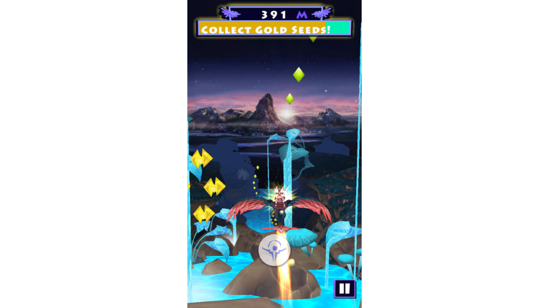
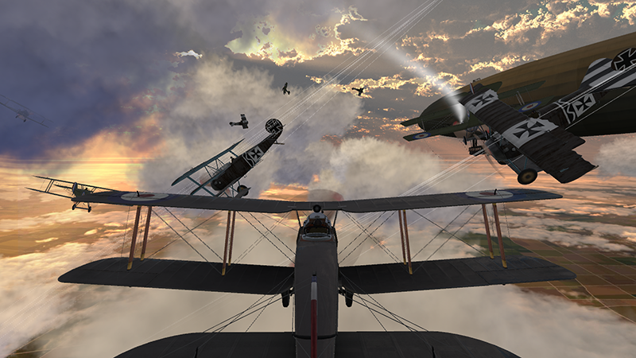
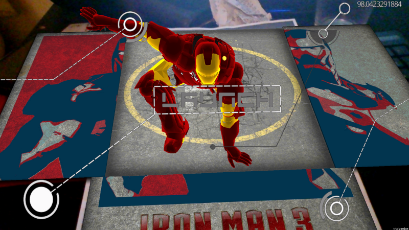
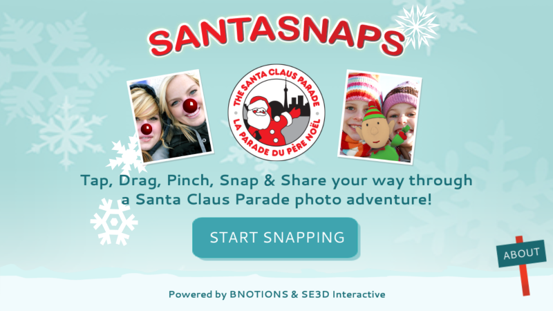
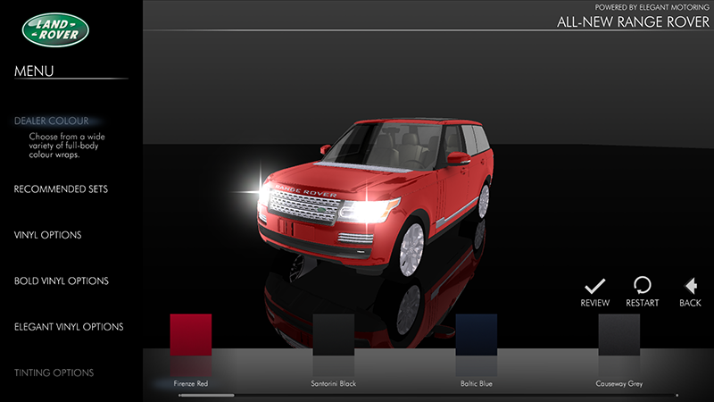
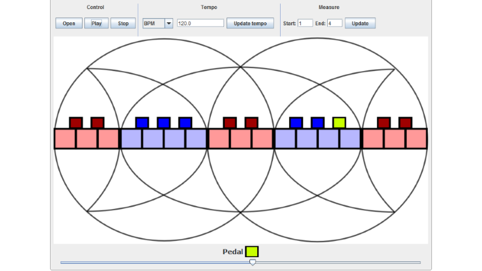
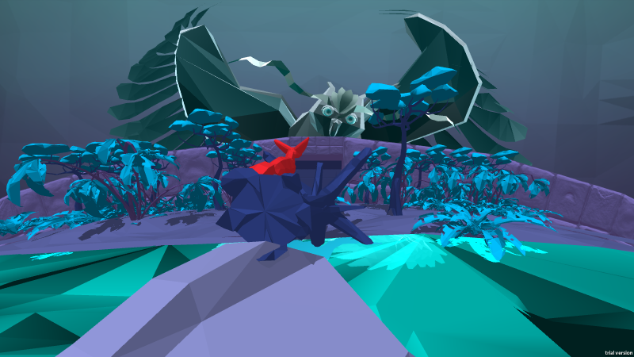
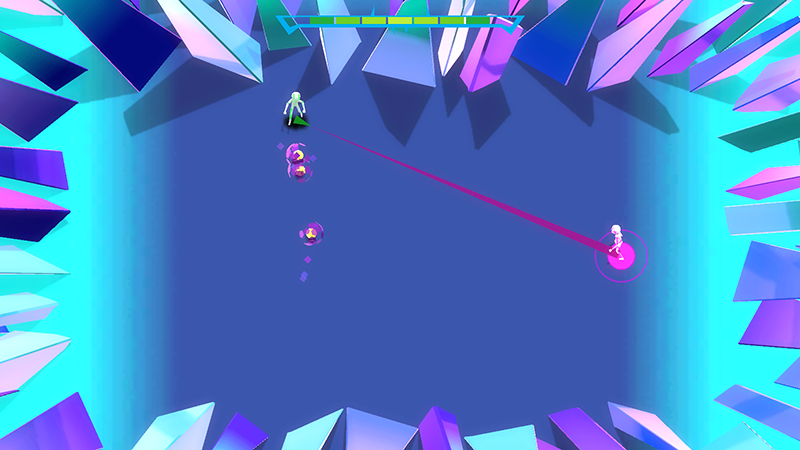

<link rel="stylesheet" type="text/css" href="../portfolio.css"/>

<h3>
<a href="#site-nav" >Top</a> •
 <a href="#pro-projects">Professional Projects</a> • <a href="#personal-projects">Personal Projects </a></h3>

<h2 id="pro-projects">Professional Projects</h2>
<h4>Skybound (2014 - current)</h4>
<figure>
	
</figure>
<strong>Unity/C#</strong> 
A 3D endless flyer. Currently available as an extended Alpha version on the <a href="https://itunes.apple.com/ca/app/skybound/id827787749?mt=8">App Store</a>. I took over the programming after that soft launch, and am in charge of generally improving the game as well as porting to Android.   

<h4>CASM (2014 - current)</h4>
<figure>
	
</figure>
<strong>Unity/C#</strong> 
Installation for the <a href="http://www.casmuseum.techno-science.ca/">Canadian Aviation and Space Museum</a>. Allows players to control a WWI plane and pilot it through a mock battle using their body (tracked by Kinect).  

<h4>Iron Man AR (2014)</h4>
<figure>
	
</figure>
<strong>Unity/C#</strong> 
Mobile 3D augmented reality app made as an internal pitch product. When the marker is detected, Iron Man lands on it from out of frame, and when the user presses the "Launch" button he animates back out of frame. 

<h4>Santa Snaps (2013)</h4>
<figure>
	
</figure>
<strong>Unity/C#</strong> 
Mobile app created for the organizers of the Toronto Santa Claus Parade. Allowed users to take pictures and augment those pictures with various decorations: animated 2D sprites of mistletoe and Rudolph noses, 3D models of dancing elves, a 3D waving Santa, etc. Also allowed users to share their creations via email, Twitter, or Facebook.  
<a href="https://play.google.com/store/apps/details?id=com.bnotions.scp&hl=en">Android</a> | <a href="https://itunes.apple.com/ca/app/santasnaps/id730568605?mt=8">iOS</a> | <a href="https://www.youtube.com/watch?v=zP6M3TMjWxw">Video</a>  

<h4>Elegant Motoring (2013)</h4>
<figure>
	
</figure>
<strong>Unity/C#</strong> 
Mobile/web vehicle customizing app created for an after-market dealer specializing in customizing Range Rovers. Allows users to customize various aspects of their car, then send an email to the dealer with the required specs, as well as optionally posting a screenshot of their customized car to Facebook/Twitter/emailing it.  
<a href="http://www.craigthomas.info/rangerover/RangeRover.html">Web Demo</a> 

<h4>MIDI Instructional App (2012)</h4>
<figure>
	
</figure>
<strong>Java</strong> 
An applet for displaying notes from a MIDI file, intended as a teaching aid to musical students.   

<h2 id="personal-projects">Personal Projects</h2>
<h4>Fox Ears (2015 - current)</h4>
<figure>
	
</figure>
<strong>Unity/C#</strong> 
3D rhythm-based platformer, made for Global Game Jam 2015 with 2 other team members (1 artist and 1 musician). The player plays as a fox attempting to navigate a series of puzzles featuring rythmic components, and must survive until the level's song ends.  
<a href="https://www.youtube.com/watch?v=97rNvLYpQCQ">Video</a> | <a href="http://angrysquidgames.itch.io/fox-ears">itch.io Page</a> 

<h4>EMDash (2014)</h4>
<figure>
	
</figure>
<strong>Unity/C#</strong> 
Top-down 3D co-op arena wave-clearing game. 2 players must work together to clear the waves of enemies that spawn. Players can move freely, but the only way to attack is to charge a dash attack that always aims you towards your partner. While you are charging your attack, your partner's movement speed is decreased, meaning communication is vital to success. Made for TOJAM9 with 4 other team members (2 other programmers and 2 artists).  
<a href="http://angrysquidgames.itch.io/emdash">itch.io Page</a> 